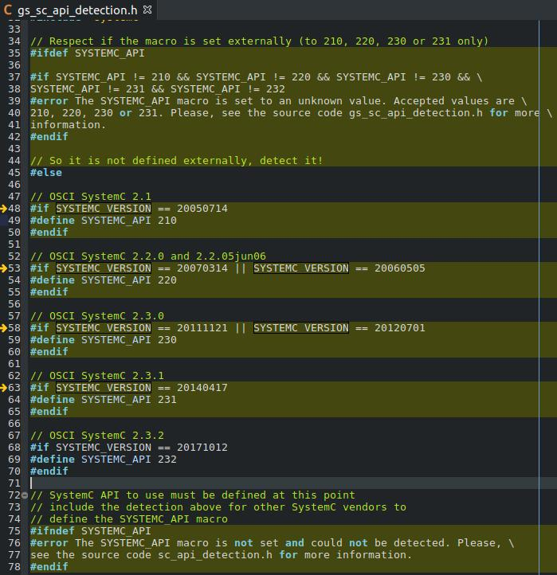

# Intel Core i7 - PCIExpress
GreenSocs [ReadMe](https://git.greensocs.com/platforms/i7-pcie)


1. git clone i7-pcie
```
$ git clone https://git.greensocs.com/platforms/i7-pcie.git
$ git submodule update --init
$ cd libs/qemu_sc
$ git submodule update --init dtc
$ cd ../..
```

2. Ubuntu Requirements
   (optional) activate Anaconda environment
```
$ source activate PY27
(PY27)$ sudo apt-get install cmake libboost-dev python-dev libglib2.0-dev libpixman-1-dev liblua5.2-dev swig
```

3. Compile and Install
   see next section to fix build errors
```
(PY27)$ cd i7-pcie
mkdir build
$ cmake -DCMAKE_INSTALL_PREFIX=build -DSYSTEMC_PREFIX=~/git/git.c-w-m/sc/systemc-2.3.2/
(PY27)$ make
(PY27)$ make install
```

4. Run
```
(PY27)$ ./libs/qemu_sc.build/bin/qemu-system-x86_64 --enable-kvm -cpu Nehalem -smp 8 --kernel ./images/bzImage --initrd ./images/rootfs.ext2
```

#### Fix Build Errors

##### First Build
Multiple problems on the initial build:
1. [`cmake` warnings](fix/1.1_cmake_warnings.md)
2. [`make` errors](fix/1.2_make_errors.md)

##### Second Build
1. add SYSTEMC_API support for version 2.3.2
   File: __gs_sc_api_detection.h__
   Edit: line 38 and add lines 67-70)
   


### Command line parameters
enable-kvm: enable kvm so the simulation is faster. cpu: the kind of CPU you want to emulate or just '?' to have a list. smp: the number of cpu to simulate. kernel: the zImage to load. initrd: the rootfs to load.

A lot of other command line parameter are available look at the qemu documentation:

### Lua configuration file
The device load a lua file SimplePCI.lua. Some parameters can be given in this file.
```
-- Global parameters for SimplePCIDevice --
SimplePCIDevice={}
SimplePCIDevice.product_id = "0x4321"

-- Device instance configuration --
Simple={}
Simple.buffer_size = "128"

quantum="100"
quantum is given in nanosecond.
```
You can just copy the SimplePCI.lua file given in the conf directory.

### Guest
A precompiled linux guest with the driver for the example device and an application example is provided with this demonstration platform.

The device driver creates a character device: /dev/example-device when the PCI module is found.

When the boot is finished you can log in with "default" user. The application example is vector_addition it takes the character device as a parameter.
```
$ vector_addition /dev/example-device.
```
The application does several thing:
* It reads the file buffer.
* Send two arrays to the Array's buffer.
* Start an addition.
* Get the computed array from the output array buffer.

### Eclipse environment
Eclipse can be used to run the platform and debug either the guest or the hardware. A complete tutorial is available in the docs directory.

### Modification
The SystemC part of the wrapper is present in ./hw/systemC directory. The device is present in the `./hw/systemC/module` directory.