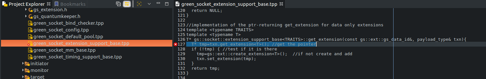
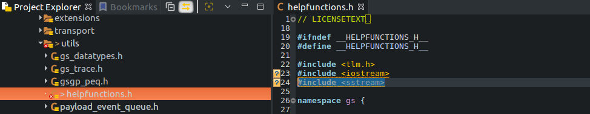

# Intel Core i7 - PCIExpress: Fix Build Errors

##### First Build
Multiple problems on the initial build:
1. [`cmake` warnings](1.1_cmake_warnings.md)
2. [`make` errors](1.2_make_errors.md)

##### Second Build
1. add SYSTEMC_API support for version 2.3.2
   File: __gs_sc_api_detection.h__
   Edit: line 38 and add lines 67-70)
   

2. expected primary-expression before ‘>’ token
```
/home/cwm/git/git.c-w-m/sc/ext/gs/i7-pcie/libs/greenlib/greensocket/include/greensocket/generic/green_socket_extension_support_base.tpp:127:29: error: expected primary-expression before ‘>’ token
   T* tmp=txn.get_extension<T>(); //get the pointer
                             ^
```
   
   to
   

3. declaration of template parameter ‘T’ shadows template parameter
```
/home/cwm/git/git.c-w-m/sc/ext/gs/i7-pcie/libs/greenlib/greencontrol/include/greencontrol/gcnf/apis/GCnf_private_Api/gcnf_private_plugin.h:47:33: error: declaration of template parameter ‘T’ shadows template parameter
   template<typename T, template<class T> class gs_param_T, typename ConfigPlugin_T> class GCnf_private_Api_T;
                                 ^~~~~
```
   
   bug fix [greencontrol: fix shadow template warning](https://git.greensocs.com/greenlib/greenlib/commit/a3e5ba40dc440113281ae71c3a4f548da4796ae7)
   to
   

4. return-statement with no value, in function returning ‘gs::cnf::gs_param<T*>::my_type&’ [-fpermissive]
```
/home/cwm/git/git.c-w-m/sc/ext/gs/i7-pcie/libs/greenlib/greencontrol/include/greencontrol/gcnf/apis/gs_param/gs_param_array.hpp:297:7: error: return-statement with no value, in function returning ‘gs::cnf::gs_param<T*>::my_type&’ [-fpermissive]
       return;
       ^~~~~~
```
	
    this is an error condition, similar code returns *this so the same can be done here to be consistent
    
    __[remaining build errors](2.4_build_errors_remaining.md)__

5. aggregate ‘std::stringstream ss’ has incomplete type and cannot be defined
```
/home/cwm/git/git.c-w-m/sc/ext/gs/i7-pcie/libs/greenlib/gsgpsocket/include/gsgpsocket/utils/helpfunctions.h:45:25: error: aggregate ‘std::stringstream ss’ has incomplete type and cannot be defined
       std::stringstream ss;
                         ^~
```
	
    add #include <sstream> to top of file

6. failed at [ 84%] Performing build step for 'qemu_sc'
	

7. are we done yet?
