# Intel Core i7 - PCIExpress: Code Revisions

## Build Errors
#### Code File Revisions
Eight files were revised, these can be found in the `fix/i7-pcie_FIX` directory
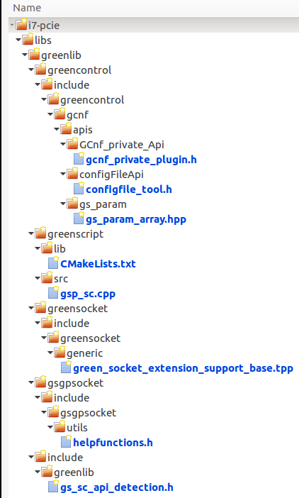

##### First Build
Multiple problems on the initial build:
1. [`cmake` warnings](notes/1.1_cmake_warnings.md)
2. [`make` errors](notes/1.2_make_errors.md)

-----

##### Incrimental Build and Fix Notes
1. add SYSTEMC_API support for version 2.3.2
File: __gs_sc_api_detection.h__
Edit: line 38 and add lines 67-70)
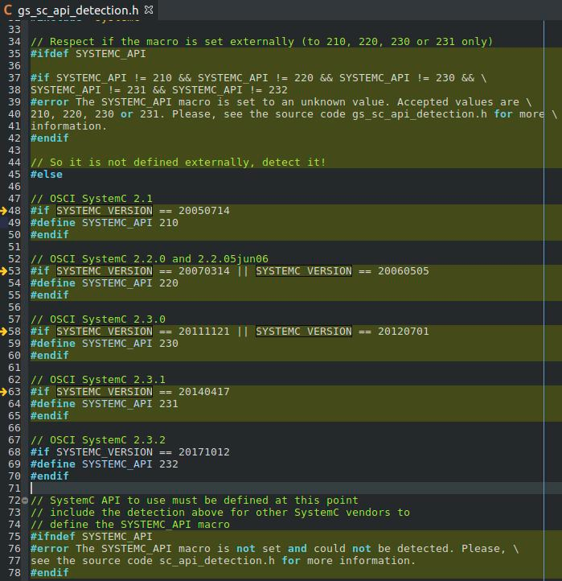
and
```
/home/cwm/git/git.c-w-m/sc/ext/gs/i7-pcie/libs/greenlib/greenscript/src/gsp_sc.cpp:425:2: error: #error Unknown SystemC API to call for sc_get_current_process_handle
 #error Unknown SystemC API to call for sc_get_current_process_handle
  ^~~~~
```
   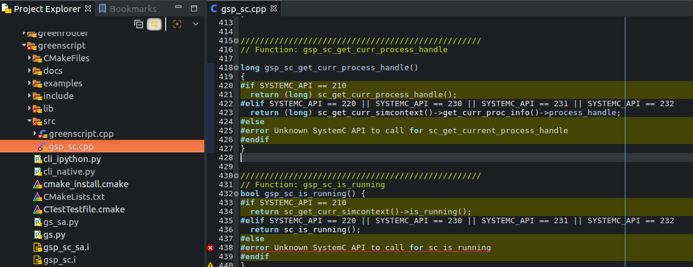

2. expected primary-expression before ‘>’ token
```
/home/cwm/git/git.c-w-m/sc/ext/gs/i7-pcie/libs/greenlib/greensocket/include/greensocket/generic/green_socket_extension_support_base.tpp:127:29: error: expected primary-expression before ‘>’ token
   T* tmp=txn.get_extension<T>(); //get the pointer
                             ^
```
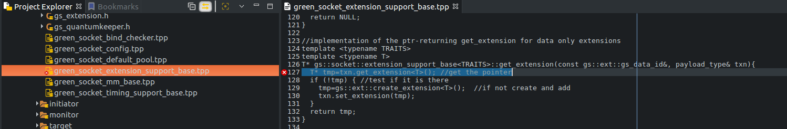
to
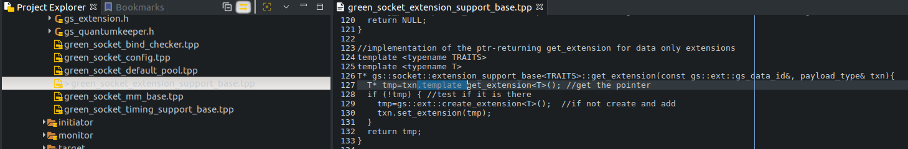

3. declaration of template parameter ‘T’ shadows template parameter
```
/home/cwm/git/git.c-w-m/sc/ext/gs/i7-pcie/libs/greenlib/greencontrol/include/greencontrol/gcnf/apis/GCnf_private_Api/gcnf_private_plugin.h:47:33: error: declaration of template parameter ‘T’ shadows template parameter
   template<typename T, template<class T> class gs_param_T, typename ConfigPlugin_T> class GCnf_private_Api_T;
                                 ^~~~~
```
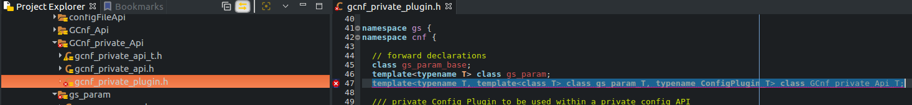
bug fix [greencontrol: fix shadow template warning](https://git.greensocs.com/greenlib/greenlib/commit/a3e5ba40dc440113281ae71c3a4f548da4796ae7)
to
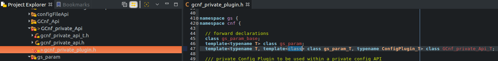

4. return-statement with no value
```
/home/cwm/git/git.c-w-m/sc/ext/gs/i7-pcie/libs/greenlib/greencontrol/include/greencontrol/gcnf/apis/gs_param/gs_param_array.hpp:297:7: error: return-statement with no value, in function returning ‘gs::cnf::gs_param<T*>::my_type&’ [-fpermissive]
       return;
       ^~~~~~
```
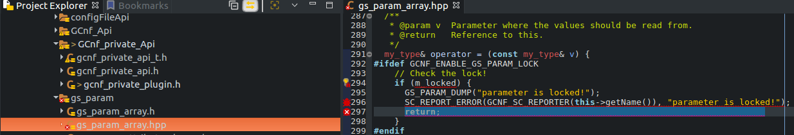
 this is an error condition, similar code returns *this so the same can be done here to be consistent
 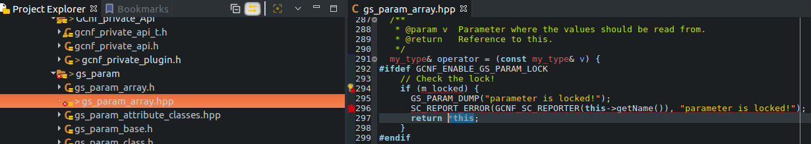

5. aggregate ‘std::stringstream ss’ has incomplete type and cannot be defined
```
/home/cwm/git/git.c-w-m/sc/ext/gs/i7-pcie/libs/greenlib/gsgpsocket/include/gsgpsocket/utils/helpfunctions.h:45:25: error: aggregate ‘std::stringstream ss’ has incomplete type and cannot be defined
       std::stringstream ss;
                         ^~
```
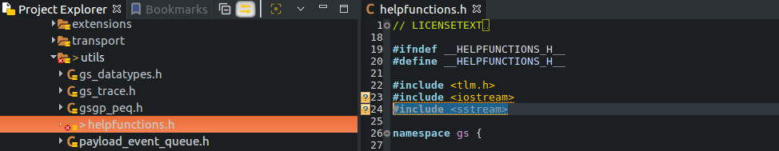
 add #include <sstream> to top of file

6. failed at [ 84%] Performing build step for `qemu_sc`

__libfdt build error__
  * tried suggestion to set ARFLAGS, [here](https://lists.gnu.org/archive/html/qemu-devel/2013-10/msg02627.html)
  * looking ahead, Python include was also wrong, export as follows and check CMakeCache.txt after rerunning cmake
```
cwm@flxsa02:~/git/git.c-w-m/sc/ext/gs/i7-pcie$ export PYTHON_INCLUDE_DIR=~/anaconda2/envs/PY27/include/python2.7
cwm@flxsa02:~/git/git.c-w-m/sc/ext/gs/i7-pcie$ export PYTHON_LIBRARY=~/anaconda2/envs/PY27/lib/libpython2.7.so
cwm@flxsa02:~/git/git.c-w-m/sc/ext/gs/i7-pcie$ export ARFLAGS="rv"
cwm@flxsa02:~/git/git.c-w-m/sc/ext/gs/i7-pcie$ source activate PY27
(PY27) cwm@flxsa02:~/git/git.c-w-m/sc/ext/gs/i7-pcie$ cmake -DCMAKE_INSTALL_PREFIX=build -DSYSTEMC_PREFIX=~/git/git.c-w-m/sc/systemc-2.3.2/
```

7. missing fstream header
```
/home/cwm/git/git.c-w-m/sc/ext/gs/i7-pcie/libs/greenlib/greencontrol/include/greencontrol/gcnf/apis/configFileApi/configfile_tool.h:202:30: error: variable ‘std::ifstream is’ has initializer but incomplete type
     std::ifstream is(filename);
                              ^
```
add
include fstream
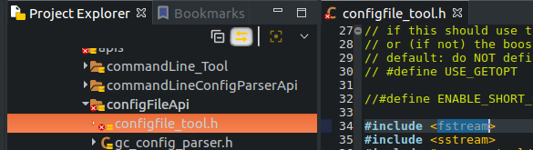

8. missing make rule for gsp_sc_saPYTHON_wrap.cxx
```
make[2]: *** No rule to make target 'libs/greenlib/greenscript/gsp_sc_saPYTHON_wrap.cxx', needed by 'libs/greenlib/greenscript/lib/CMakeFiles/_gsp_sc_sa.so.dir/__/gsp_sc_saPYTHON_wrap.cxx.o'.  Stop.
CMakeFiles/Makefile2:2079: recipe for target 'libs/greenlib/greenscript/lib/CMakeFiles/_gsp_sc_sa.so.dir/all' failed
```
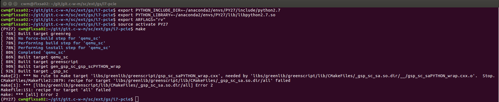

After a clean cmake and make build the error persisted
```
[ 92%] Linking CXX shared module _gsp_sc.so
[ 92%] Built target _gsp_sc
make[2]: *** No rule to make target 'libs/greenlib/greenscript/gsp_sc_saPYTHON_wrap.cxx', needed by 'libs/greenlib/greenscript/lib/CMakeFiles/_gsp_sc_sa.so.dir/__/gsp_sc_saPYTHON_wrap.cxx.o'.  Stop.
CMakeFiles/Makefile2:2079: recipe for target 'libs/greenlib/greenscript/lib/CMakeFiles/_gsp_sc_sa.so.dir/all' failed
make[1]: *** [libs/greenlib/greenscript/lib/CMakeFiles/_gsp_sc_sa.so.dir/all] Error 2
Makefile:151: recipe for target 'all' failed
make: *** [all] Error 2
```
[cmake warnings and build error](notes/2.8_cmake_warnings_build_error.md)

a similar issue was reported which seems to have fixed the problem
[greenscript: fix SWIG build with latest version of SWIG and parallel build](https://git.greensocs.com/greenlib/greenlib/commit/1878adebee008a1838e5aa464d7e7bd82e7eae51)

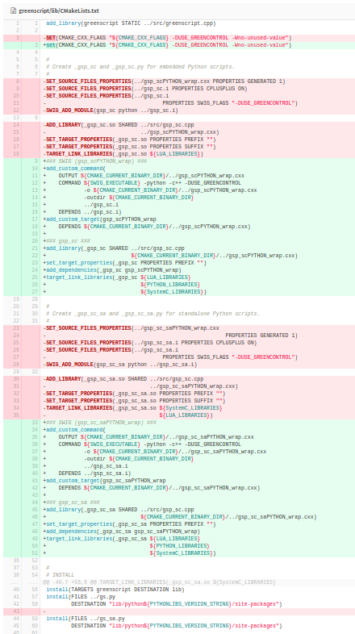

9. PyString_FromString not found
```
/home/cwm/git/git.c-w-m/sc/ext/gs/i7-pcie/libs/greenlib/greenscript/src/greenscript.cpp:178:13: error: ‘PyString_FromString’ was not declared in this scope
   name_py = PyString_FromString(name());  // new ref
             ^~~~~~~~~~~~~~~~~~~
```

This error occured after taking a clean code clone, revising the eight code files, and then running make:
[`git clone and update`](notes/fix09.2_git_clone_update.md)
[`cmake`](notes/fix09.3_cmake_warnings.md) with warnings
[`make`](notes/fix09.4_make_errors.md) with __errors__
The problem is with the CMakeCache.txt file.  The Python include and library directory is not correctly set to the Anaconda environment (PY27)
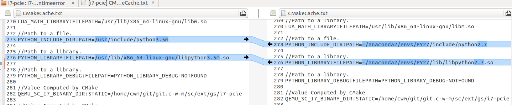
lines __312__ and __315__ also need to be revised with the correct python library
[`make`](notes/fix09.6_make_warnings.md) __build without errors__ but many warnings ;-(
[`make install`](notes/fix09.7_make_install.md) into `build` directory

##### Runtime Errors
1. SimplePCI.lua file is missing
You'll get this error if the directory from which you run does not have a `SimplePCI.lua` file.
export set at command line:
```
$ export PYTHON_INCLUDE_DIR=~/anaconda2/envs/PY27/include/python2.7
$ export PYTHON_LIBRARY=~/anaconda2/envs/PY27/lib/libpython2.7.so
$ export ARFLAGS="rv"
$ source activate PY27
(PY27) $
```
runtime command:
```
(PY27) $ ./libs/qemu_sc.build/bin/qemu-system-x86_64 --enable-kvm -cpu Nehalem -smp 8 --kernel ./images/bzImage --initrd ./images/rootfs.ext2
```
response for simulation:
```
        SystemC 2.3.2-Accellera --- May  1 2018 20:53:39
        Copyright (c) 1996-2017 by all Contributors,
        ALL RIGHTS RESERVED
```
```
Error to open/read the config file: SimplePCI.lua
```
```
(process:26817): GLib-WARNING **: /build/glib2.0-prJhLS/glib2.0-2.48.2/./glib/gmem.c:483: custom memory allocation vtable not supported
sc_platform.cpp: debug: SystemC platform init.
Quantum is wrong, either you specified a 0 quantum or didn't specify a quantum in the lua script.
Aborted (core dumped)
(PY27) cwm@flxsa02:~/git/git.c-w-m/sc/ext/gs/i7-pcie$ 
```
FIX: copy the `SimplePCI.lua` file from the `conf/` directory into the project root.
```
$ cp conf/SimplePCI.lua ./
```
2. Everything should work now!
