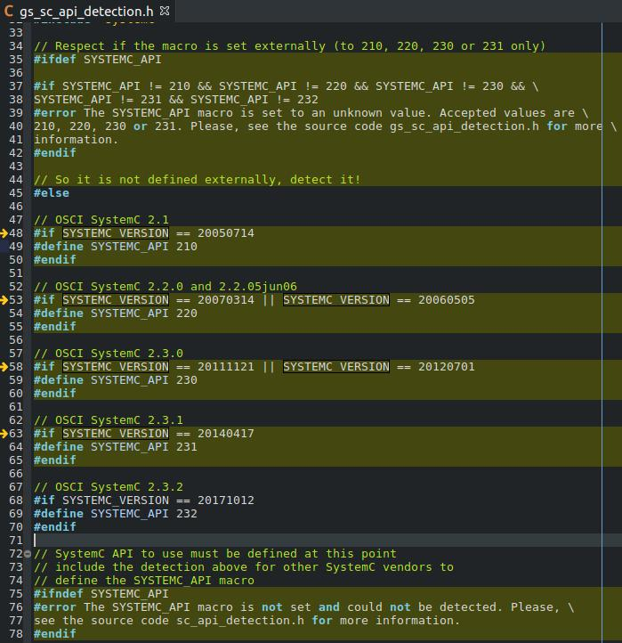
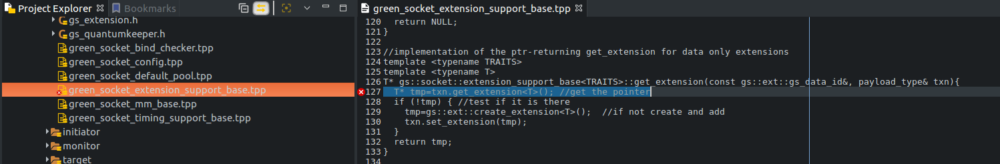
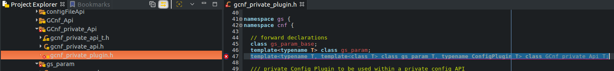
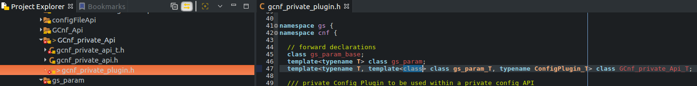
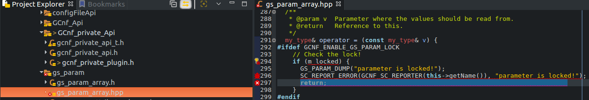
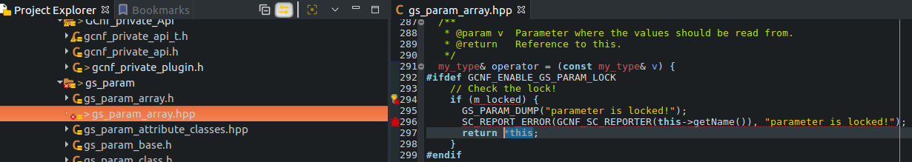
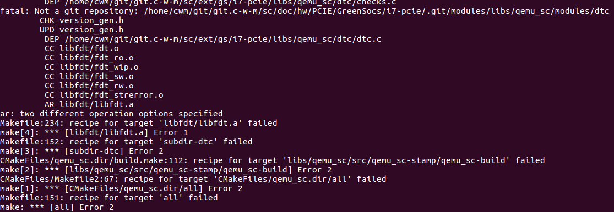
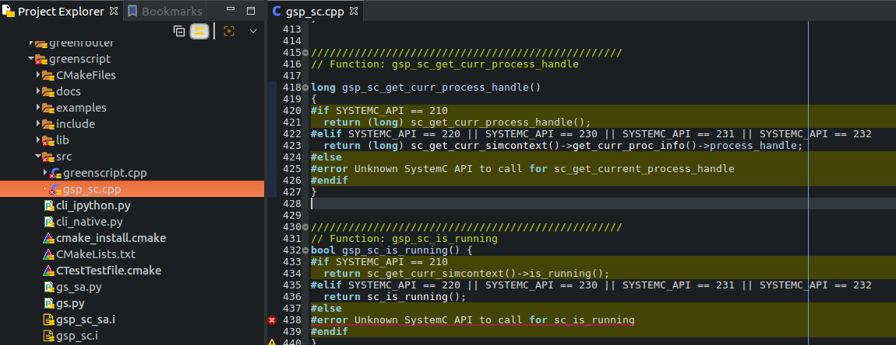
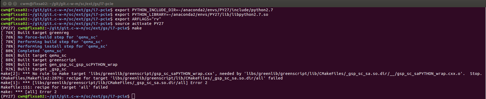
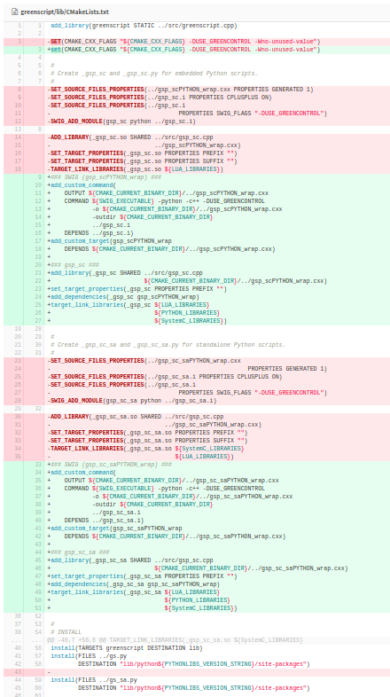

# Intel Core i7 - PCIExpress: Fix Build Errors

##### First Build
Multiple problems on the initial build:
1. [`cmake` warnings](1.1_cmake_warnings.md)
2. [`make` errors](1.2_make_errors.md)

##### Second Build
1. add SYSTEMC_API support for version 2.3.2
   File: __gs_sc_api_detection.h__
   Edit: line 38 and add lines 67-70)
   

2. expected primary-expression before ‘>’ token
```
/home/cwm/git/git.c-w-m/sc/ext/gs/i7-pcie/libs/greenlib/greensocket/include/greensocket/generic/green_socket_extension_support_base.tpp:127:29: error: expected primary-expression before ‘>’ token
   T* tmp=txn.get_extension<T>(); //get the pointer
                             ^
```
   
   to
   

3. declaration of template parameter ‘T’ shadows template parameter
```
/home/cwm/git/git.c-w-m/sc/ext/gs/i7-pcie/libs/greenlib/greencontrol/include/greencontrol/gcnf/apis/GCnf_private_Api/gcnf_private_plugin.h:47:33: error: declaration of template parameter ‘T’ shadows template parameter
   template<typename T, template<class T> class gs_param_T, typename ConfigPlugin_T> class GCnf_private_Api_T;
                                 ^~~~~
```
   
   bug fix [greencontrol: fix shadow template warning](https://git.greensocs.com/greenlib/greenlib/commit/a3e5ba40dc440113281ae71c3a4f548da4796ae7)
   to
   

4. return-statement with no value, in function returning ‘gs::cnf::gs_param<T*>::my_type&’ [-fpermissive]
```
/home/cwm/git/git.c-w-m/sc/ext/gs/i7-pcie/libs/greenlib/greencontrol/include/greencontrol/gcnf/apis/gs_param/gs_param_array.hpp:297:7: error: return-statement with no value, in function returning ‘gs::cnf::gs_param<T*>::my_type&’ [-fpermissive]
       return;
       ^~~~~~
```
	
    this is an error condition, similar code returns *this so the same can be done here to be consistent
    
    __[remaining build errors](2.4_build_errors_remaining.md)__

5. aggregate ‘std::stringstream ss’ has incomplete type and cannot be defined
```
/home/cwm/git/git.c-w-m/sc/ext/gs/i7-pcie/libs/greenlib/gsgpsocket/include/gsgpsocket/utils/helpfunctions.h:45:25: error: aggregate ‘std::stringstream ss’ has incomplete type and cannot be defined
       std::stringstream ss;
                         ^~
```
	
    add #include <sstream> to top of file

6. failed at [ 84%] Performing build step for 'qemu_sc'
	

	__libfdt build error__
  * tried suggestion to set ARFLAGS, [here](https://lists.gnu.org/archive/html/qemu-devel/2013-10/msg02627.html)
  * looking ahead, Python include was also wrong, export as follows and check CMakeCache.txt after rerunning cmake
```
cwm@flxsa02:~/git/git.c-w-m/sc/ext/gs/i7-pcie$ export PYTHON_INCLUDE_DIR=~/anaconda2/envs/PY27/include/python2.7
cwm@flxsa02:~/git/git.c-w-m/sc/ext/gs/i7-pcie$ export PYTHON_LIBRARY=~/anaconda2/envs/PY27/lib/libpython2.7.so
cwm@flxsa02:~/git/git.c-w-m/sc/ext/gs/i7-pcie$ export ARFLAGS="rv"
cwm@flxsa02:~/git/git.c-w-m/sc/ext/gs/i7-pcie$ source activate PY27
(PY27) cwm@flxsa02:~/git/git.c-w-m/sc/ext/gs/i7-pcie$ cmake -DCMAKE_INSTALL_PREFIX=build -DSYSTEMC_PREFIX=~/git/git.c-w-m/sc/systemc-2.3.2/
```

7. missing fstream header
```
/home/cwm/git/git.c-w-m/sc/ext/gs/i7-pcie/libs/greenlib/greencontrol/include/greencontrol/gcnf/apis/configFileApi/configfile_tool.h:202:30: error: variable ‘std::ifstream is’ has initializer but incomplete type
     std::ifstream is(filename);
                              ^
```
add
include fstream

8. SYSTEMC_API missing in two more places
```
/home/cwm/git/git.c-w-m/sc/ext/gs/i7-pcie/libs/greenlib/greenscript/src/gsp_sc.cpp:425:2: error: #error Unknown SystemC API to call for sc_get_current_process_handle
 #error Unknown SystemC API to call for sc_get_current_process_handle
  ^~~~~
```
add as needed


9. missing make rule for gsp_sc_saPYTHON_wrap.cxx
```
make[2]: *** No rule to make target 'libs/greenlib/greenscript/gsp_sc_saPYTHON_wrap.cxx', needed by 'libs/greenlib/greenscript/lib/CMakeFiles/_gsp_sc_sa.so.dir/__/gsp_sc_saPYTHON_wrap.cxx.o'.  Stop.
CMakeFiles/Makefile2:2079: recipe for target 'libs/greenlib/greenscript/lib/CMakeFiles/_gsp_sc_sa.so.dir/all' failed
```


10.  recipe for target 'libs/greenlib/greenscript/lib/CMakeFiles/_gsp_sc_sa.so.dir/all' failed
	ran cmake and make again to see if error would repeat, it did!
```
[ 92%] Linking CXX shared module _gsp_sc.so
[ 92%] Built target _gsp_sc
make[2]: *** No rule to make target 'libs/greenlib/greenscript/gsp_sc_saPYTHON_wrap.cxx', needed by 'libs/greenlib/greenscript/lib/CMakeFiles/_gsp_sc_sa.so.dir/__/gsp_sc_saPYTHON_wrap.cxx.o'.  Stop.
CMakeFiles/Makefile2:2079: recipe for target 'libs/greenlib/greenscript/lib/CMakeFiles/_gsp_sc_sa.so.dir/all' failed
make[1]: *** [libs/greenlib/greenscript/lib/CMakeFiles/_gsp_sc_sa.so.dir/all] Error 2
Makefile:151: recipe for target 'all' failed
make: *** [all] Error 2
```
	[cmake warnings and build error](2.10.1_cmake_warnings_build_error.md)

	similar issue reported
	[greenscript: fix SWIG build with latest version of SWIG and parallel build](https://git.greensocs.com/greenlib/greenlib/commit/1878adebee008a1838e5aa464d7e7bd82e7eae51)
	

11. [run error](2.11.1_Run_Error.md)
run command
```
(PY27)$ ./libs/qemu_sc.build/bin/qemu-system-x86_64 --enable-kvm -cpu Nehalem -smp 8 --kernel ./images/bzImage --initrd ./images/rootfs.ext2
```